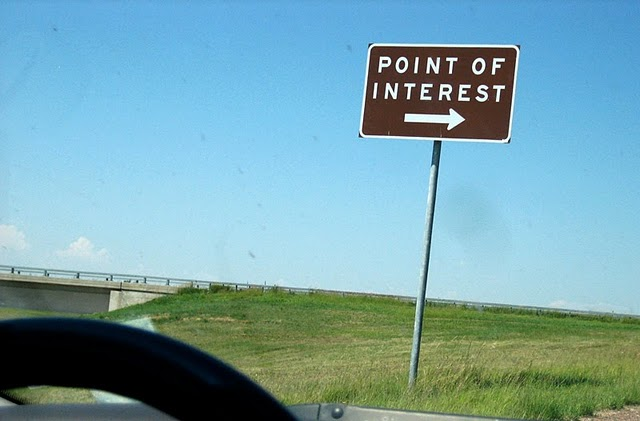
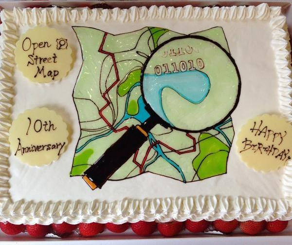
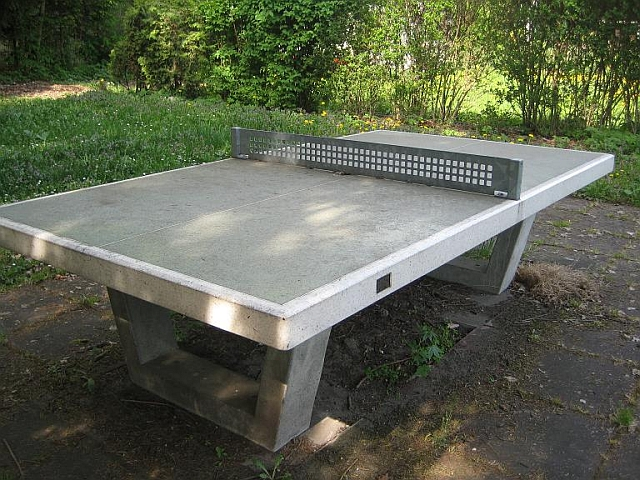
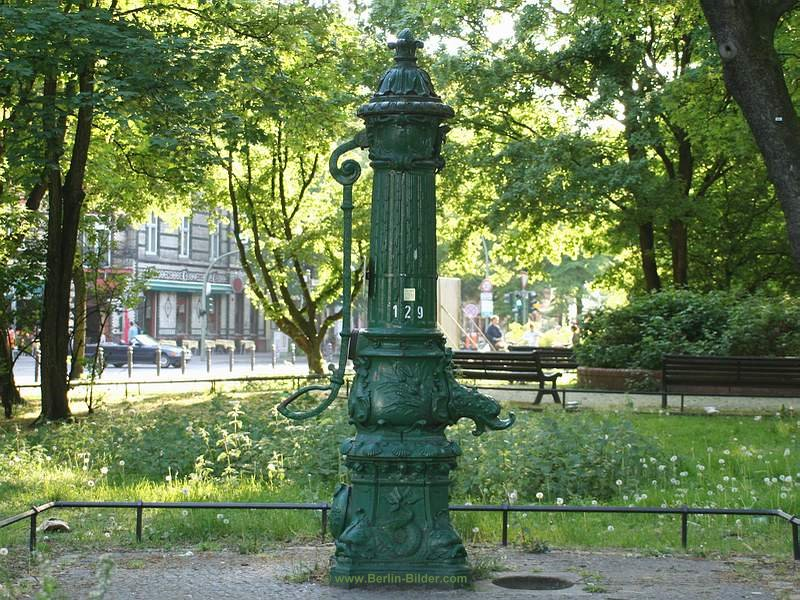

# General concepts

## POI: point of interest

 

## OpenStreetMap



 * Stores nodes, ways (collection of nodes) and relations (collection of nodes/ways)
 * Each element can have tags (key / value pairs):

https://www.openstreetmap.org/node/29190909

Key        | Value
---------  | -------------
name	     | U Bernauer Straße
railway	   | station
station	   | subway
wheelchair | yes

 * [Map features](http://wiki.openstreetmap.org/wiki/Map_Features)

## Edit maps with ID

## Query data with [overpass][]

### find ping pong tables



[pongify.us]

#### overpass query

```xml
<query type="node">
  <has-kv k="leisure" v="pitch"/>
  <has-kv k="sport" v="table_tennis"/>
  <bbox-query {{bbox}}/>
</query>

<print mode="meta"/>
```

#### overpass query including ways (areas)

```xml
<union>
  <query type="node">
    <has-kv k="sport" v="table_tennis"/>
    <bbox-query {{bbox}}/>
  </query>

  <query type="way">
    <has-kv k="sport" v="table_tennis"/>
    <bbox-query {{bbox}}/>
  </query>
  <recurse type="down"/>
</union>

<print mode="meta"/>
```

### find drinking water / pumps



#### overpass query

```xml
<query type="node">
  <has-kv k="amenity" v="drinking_water"/>
  <bbox-query {{bbox}}/>
</query>

<print mode="meta"/>
```

### find ping pong tables near water

```xml
<query type="node">
  <has-kv k="amenity" v="drinking_water"/>
  <bbox-query {{bbox}}/>
</query>

<query type="node">
  <around radius="300"/>
  <has-kv k="leisure" v="pitch"/>
  <has-kv k="sport" v="table_tennis"/>
</query>

<print mode="meta"/>
```

## Export and share with GeoJSON

 ```json
 {
   "type": "FeatureCollection",
   "features": [
     {
       "geometry": {
         "type": "Point",
         "coordinates": [
           13.3192854,
           52.4904865
         ]
       }
     }
   ]
 }
 ```

# Tools

 * [OpenStreetMap][]
 * [geojson.io][]
 * [Leaflet]
 * [gist][] + [bl.ocks.org][]

[OpenStreetMap]: https://www.openstreetmap.org/
[pongify.us]: http://pongify.us
[Leaflet]: http://leafletjs.com/
[geojson.io]: http://geojson.io
[overpass]: http://overpass-turbo.eu/
[gist]: http://gist.github.com
[bl.ocks.org]: http://bl.ocks.org/
